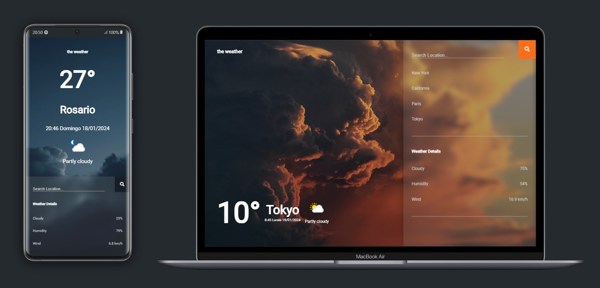

# Responsive Weather App

## Description

Welcome to the Responsive Weather App, a user-friendly application designed to provide real-time weather information for your location and beyond. Immerse yourself in a seamless and intuitive experience that combines the power of HTML, CSS, and JavaScript to deliver up-to-date weather details.

## Frontend Technologies Used

- **HTML:** Lays the foundation for the structure of the weather app.
- **CSS:** Enhances the visual appeal, ensuring a clean and responsive design.
- **JavaScript:** Drives interactivity, offering dynamic updates based on live weather data.

## Backend Web API (ASP.NET Core 6.0)

The Responsive Weather App seamlessly integrates with a backend built using ASP.NET Core 6.0, hosted at [https://guidopellegriniweatherbackend.bsite.net/index.html](https://guidopellegriniweatherbackend.bsite.net/index.html). This backend serves as an intermediary to handle the WeatherAPI key and redirects requests to [https://www.weatherapi.com](https://www.weatherapi.com) to fetch accurate and up-to-date weather data.

## Additional Features

- **API Key Security:** The API key required for accessing [https://www.weatherapi.com](https://www.weatherapi.com) is securely stored in the backend, preventing direct exposure in client-side code. This enhances the application's security and safeguards the API key against unauthorized access.

- **Request Redirection:** All requests to the WeatherAPI are routed through the backend, allowing for additional control, such as error management and response optimization before being sent to the frontend application. Redirection ensures an efficient and reliable data flow.

## Live

[Responsive Weather App](https://guidopellegrini.github.io/responsive-weather-app/)

## Preview

